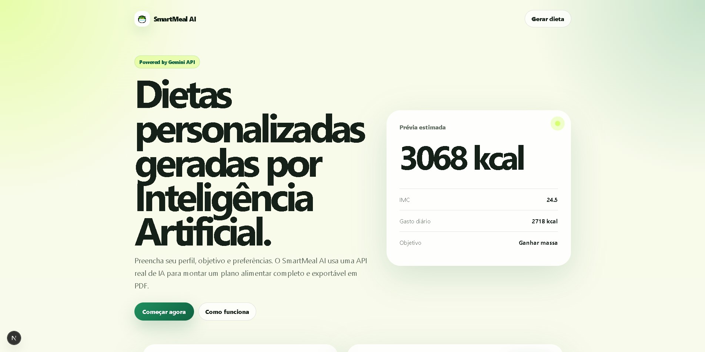
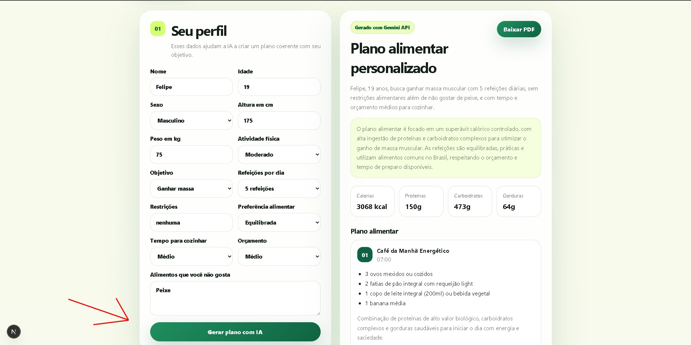

# SmartMeal AI

Site interativo em **HTML, CSS, JavaScript, React e Next.js** que usa uma **API real de Inteligência Artificial** para gerar dietas personalizadas com base no perfil do usuário.

A aplicação coleta dados como altura, peso, idade, objetivo, rotina de exercícios, restrições e preferências. Depois chama a **Gemini API** pelo servidor do próprio Next.js e retorna um plano alimentar estruturado com refeições, macros, lista de compras, dicas e exportação em PDF.

> Aviso: este projeto é educacional. Ele não substitui consulta com nutricionista.

---

## Preview do projeto

### Tela inicial



### Formulário e plano alimentar gerado



---

## O que mudou nesta versão

A versão anterior usava uma IA simulada no front-end. Esta versão usa uma chamada real para a Gemini API:

```txt
Front-end React
   ↓
/api/generate-diet, Route Handler do Next.js
   ↓
Gemini API
   ↓
Plano alimentar em JSON
   ↓
Interface + PDF
```

A chave da IA fica no arquivo `.env.local`, ou seja, não é exposta no navegador.

---

## Funcionalidades

- Formulário interativo com dados do usuário
- Objetivos: emagrecer, manter peso ou ganhar massa
- Preferências alimentares e restrições
- Cálculo estimado de IMC, gasto calórico e macronutrientes
- Geração real com IA usando Gemini API
- Retorno em JSON estruturado
- Exibição bonita do plano na tela
- Download do plano em PDF
- Layout responsivo
- Fallback simples caso a chave da API não esteja configurada

---

## Tecnologias

- HTML
- CSS
- JavaScript
- React
- Next.js App Router
- Next.js Route Handler
- Gemini API
- jsPDF

---

## Como configurar a IA gratuita

1. Acesse o Google AI Studio:

```txt
https://aistudio.google.com/app/apikey
```

2. Crie uma API key.

3. Na raiz do projeto, crie um arquivo chamado `.env.local`.

4. Coloque sua chave:

```env
GEMINI_API_KEY=sua_chave_aqui
GEMINI_MODEL=gemini-2.5-flash
```

> O arquivo `.env.local` não deve ser enviado para o GitHub.

---

## Como rodar o projeto

Instale as dependências:

```bash
npm install
```

Rode o servidor de desenvolvimento:

```bash
npm run dev
```

Abra no navegador:

```txt
http://localhost:3000
```

---

## Como testar

Preencha o formulário com dados de exemplo:

```txt
Nome: Felipe
Idade: 19
Sexo: Masculino
Altura: 175
Peso: 75
Atividade: Moderado
Objetivo: Ganhar massa
Refeições: 5
Restrições: nenhuma
Preferência: alta proteína
Orçamento: médio
```

Clique em **Gerar plano com IA**.

Se a chave estiver correta, o card de resultado deve aparecer com a etiqueta:

```txt
Gerado com Gemini API
```

---

## Onde fica a chamada da IA?

Arquivo:

```txt
app/api/generate-diet/route.js
```

Trecho principal:

```js
const response = await fetch(
  `https://generativelanguage.googleapis.com/v1beta/models/${model}:generateContent?key=${apiKey}`,
  {
    method: 'POST',
    headers: {
      'Content-Type': 'application/json'
    },
    body: JSON.stringify({
      contents: [
        {
          role: 'user',
          parts: [{ text: buildPrompt(form, nutrition) }]
        }
      ],
      generationConfig: {
        temperature: 0.45,
        responseMimeType: 'application/json'
      }
    })
  }
);
```

---

## Observação importante

Mesmo usando IA, o projeto não deve ser apresentado como substituto de nutricionista. O ideal é dizer que ele é uma ferramenta de apoio educacional para montar uma sugestão inicial de alimentação.
